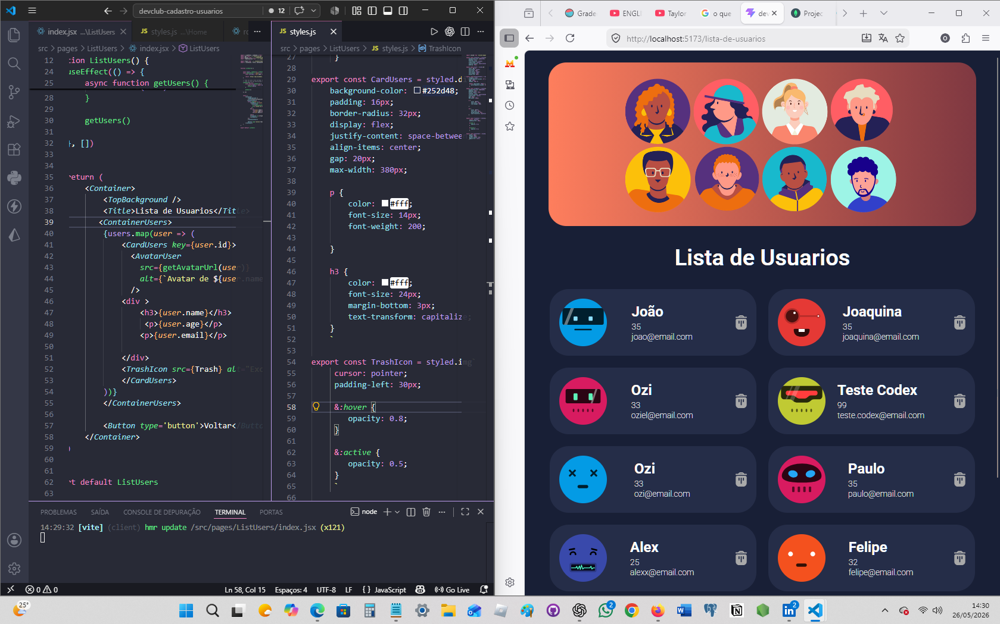

# Cadastro de Usuários 🚀

Aplicação web para cadastro, listagem e exclusão de usuários. O projeto foi desenvolvido com React e Vite, utilizando rotas com React Router, requisições HTTP com Axios e estilos com styled-components.

## Preview 👀




## Funcionalidades ✨

- 📝 Cadastro de usuários com nome, idade e email.
- 📋 Listagem de usuários cadastrados.
- 🗑️ Exclusão de usuários com atualização imediata da interface.
- 🔀 Navegação entre tela de cadastro e tela de listagem.
- 🖼️ Avatar automático para cada usuário usando DiceBear.
- 📱 Interface responsiva para desktop e dispositivos menores.

## Tecnologias 🛠️

- React
- Vite
- React Router DOM
- Axios
- Styled-components
- ESLint

## Estrutura Principal 📁

```txt
src/
  componets/
    Button/
    background/
  pages/
    Home/
    ListUsers/
  services/
    api.js
  styles/
    GlobalStyles.js
  routes.jsx
  main.jsx
```

## Rotas da Aplicação 🧭

| Rota | Descrição |
| --- | --- |
| `/` | Tela de cadastro de usuários |
| `/lista-de-usuarios` | Tela com a lista de usuários cadastrados |

## API 🔌

A aplicação consome uma API local configurada em:

```js
http://localhost:3000
```

Endpoint utilizado:

```txt
/usuarios
```

Formato esperado para um usuario:

```json
{
  "id": "1",
  "name": "Maria Silva",
  "age": 25,
  "email": "maria@email.com"
}
```

Operacoes utilizadas:

| Metodo | Endpoint | Descricao |
| --- | --- | --- |
| `GET` | `/usuarios` | Lista todos os usuarios |
| `POST` | `/usuarios` | Cadastra um novo usuario |
| `DELETE` | `/usuarios/:id` | Remove um usuario |

## Como Rodar o Projeto ▶️

Clone o repositório:

```bash
git clone <url-do-repositorio>
```

Acesse a pasta do projeto:

```bash
cd devclub-cadastro-usuarios
```

Instale as dependências:

```bash
npm install
```

Inicie a API local na porta `3000`.

Depois, rode a aplicação:

```bash
npm run dev
```

Acesse no navegador:

```txt
http://localhost:5173
```

## Scripts Disponíveis 🧾

| Comando | Descrição |
| --- | --- |
| `npm run dev` | Inicia o servidor de desenvolvimento |
| `npm run build` | Gera a versão de produção |
| `npm run preview` | Executa uma prévia da build |
| `npm run lint` | Analisa o código com ESLint |

## Observações ⚠️

- 🔁 A API precisa estar em execução para cadastrar, listar e excluir usuários.
- 🔗 A base URL da API está configurada em `src/services/api.js`.
- 👥 Os avatares são gerados automaticamente a partir do nome, email ou id do usuário.
